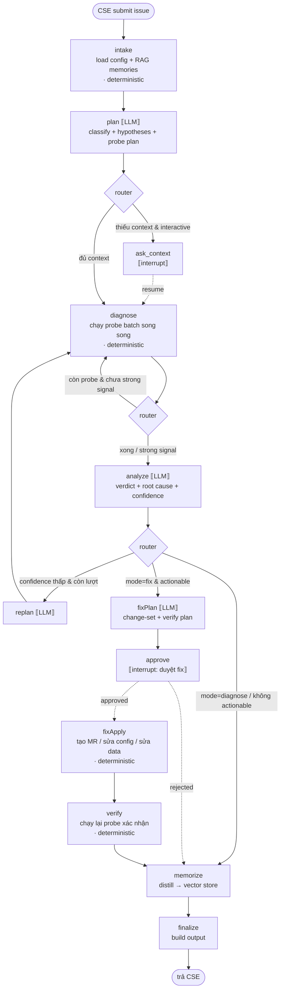

# Shopify Embedded App — Super Support Agent · PLANNING

> Tài liệu thiết kế tổng thể (xây mới từ đầu). Mục tiêu: 1 agent điều phối (orchestrator)
> nhận issue từ **CSE** (người làm việc trực tiếp với merchant), tự truy vết **lỗi nằm ở đâu**
> trên toàn bộ surface của một Shopify embedded app, và **fix được luôn** lỗi đó (qua MR / config / data)
> dưới sự kiểm soát của con người.

---

## 0. TL;DR — Triết lý cốt lõi

1. **Một state chuẩn duy nhất**, một graph điều phối duy nhất. Không vỡ vụn thành chục sub-graph
   (đây là điểm sửa so với bản cũ `opensupport`). Mỗi "surface" là một **investigator module
   deterministic**, không phải một compiled sub-graph riêng.
2. **LLM chỉ làm phần suy luận**, không bao giờ trực tiếp lấy dữ liệu. Toàn bộ "lấy bằng chứng"
   do tool deterministic làm. → giảm hallucination tối đa.
3. **Tool không cần fallback.** Surface nào không được cấu hình / không lấy được → probe đó
   `skipped` kèm `reason`, ghi vào state, đi tiếp. Không có chuỗi fallback phức tạp.
4. **Mọi output của LLM đều structured (zod-validated)** và phải **trích dẫn evidence có thật**.
5. **Con người là cổng cuối** trước khi ghi (interrupt/approve trước khi apply fix).
6. **Agent tự học**: sau mỗi case, distill thành "case memory" → vector store → RAG cho lần sau.

Một lần chạy `diagnose` điển hình tốn **2 LLM call** (plan + analyze). Một lần `fix` tốn **3**
(plan + analyze + fix_plan). Mọi bước còn lại là code thuần.

---

## 1. Mục tiêu & phạm vi

### Người dùng

- **CSE (supporter)**: nhập issue (mô tả của merchant + context), theo dõi quá trình chẩn đoán,
  cung cấp thêm thông tin khi agent hỏi, và **duyệt fix**.
- **Dev/maintainer**: cấu hình app (connection string, service, repo GitLab, token...), review MR
  do agent tạo, quản lý memory/tool.

### Việc agent phải làm được

| #   | Năng lực               | Mô tả                                                           |
| --- | ---------------------- | --------------------------------------------------------------- |
| 1   | Tiếp nhận & chuẩn hoá  | Nhận issue tự do từ CSE → caseType + identifiers + missing info |
| 2   | Lập kế hoạch chẩn đoán | Sinh hypotheses + danh sách "probe" cần chạy (LLM)              |
| 3   | Thu thập bằng chứng    | Chạy probe deterministic trên code/DB/logs/Shopify/browser      |
| 4   | Suy luận root cause    | Tổng hợp evidence → verdict + nguyên nhân + độ tin cậy (LLM)    |
| 5   | Đề xuất & áp dụng fix  | Sinh change-set → duyệt (HITL) → tạo MR / sửa config / sửa data |
| 6   | Verify                 | Chạy lại probe để xác nhận fix giải quyết được signal           |
| 7   | Ghi nhớ                | Distill case → vector store, dùng lại cho lần sau (RAG)         |
| 8   | Interrupt / Resume     | Dừng hỏi context / chờ duyệt, lưu state bền, resume đúng chỗ    |

### Ngoài phạm vi (v1) — đã chốt

- **Auto-fix v1 = chỉ tạo MR** (GitLab branch + MR). Không auto-merge, không deploy.
- **Config-fix / data-fix: hoãn sang v2** (đã thiết kế sẵn cổng duyệt + token riêng + dry-run để bật sau).
- Tự merge MR / tự deploy.
- Multi-tenant phân quyền phức tạp (v1: nội bộ team).

---

## 2. Taxonomy issue — xương sống của "bao quát hết issue"

Mọi issue của embedded app đều quy về **(caseType) × (surface chứa nguyên nhân)**. Đây là lý do
một state + một workflow generic vẫn phủ được tất cả: agent chỉ thay đổi _probe nào chạy trên
surface nào_, không thay đổi quy trình.

### 2.1. `caseType` (phân loại nguyên nhân)

```
installation_oauth     – cài đặt/OAuth/activation: install lỗi, redirect fail, re-auth loop
embedded_admin_ui      – màn admin nhúng trắng/lỗi App Bridge, session token (JWT), CSP/frame-ancestors
storefront_extension   – theme app extension / app embed / script không load, widget hỏng
webhook_sync           – webhook không nhận, HMAC fail, data không sync, thiếu subscription, GDPR webhooks
api_permission         – GraphQL/REST lỗi, rate limit/throttle, scope thiếu, API version deprecated
billing                – charge không tạo, recurring/subscription không active, billing API lỗi
data_integrity         – record thiếu/sai, sync trễ, sync một phần
performance            – chậm, timeout, query nặng, web vitals
configuration          – sai setting/env/feature flag/connection
frontend_bug           – lỗi render Polaris/JS trong UI nhúng
unknown                – chưa phân loại được → cần thêm context
```

### 2.2. `surface` (nơi chứa bằng chứng / nguyên nhân)

```
code      – repo GitLab (backend + embedded frontend + extension)
database  – DB app (read-only): shop, token, settings, entity đã sync, trạng thái job/queue
logs      – application logs / error tracking (theo identifier + time window)
shopify   – Shopify Admin API của chính shop: install status, scopes, webhooks, billing, API health
browser   – Playwright render storefront/admin → DOM/console/network/script signals
config    – cấu hình app (connection string, service endpoint, flag)
```

### 2.3. Ma trận caseType → surface ưu tiên (router gợi ý cho Planner)

| caseType             | code | database | logs | shopify | browser | config |
| -------------------- | :--: | :------: | :--: | :-----: | :-----: | :----: |
| installation_oauth   |  ◑   |    ●     |  ●   |    ●    |    ○    |   ◑    |
| embedded_admin_ui    |  ●   |    ○     |  ◑   |    ◑    |    ●    |   ◑    |
| storefront_extension |  ●   |    ○     |  ○   |    ◑    |    ●    |   ◑    |
| webhook_sync         |  ●   |    ●     |  ●   |    ●    |    ○    |   ◑    |
| api_permission       |  ●   |    ○     |  ●   |    ●    |    ○    |   ◑    |
| billing              |  ●   |    ●     |  ●   |    ●    |    ○    |   ○    |
| data_integrity       |  ◑   |    ●     |  ◑   |    ◑    |    ○    |   ○    |
| performance          |  ●   |    ◑     |  ●   |    ◑    |    ◑    |   ◑    |
| configuration        |  ◑   |    ○     |  ◑   |    ◑    |    ○    |   ●    |
| frontend_bug         |  ●   |    ○     |  ◑   |    ○    |    ●    |   ○    |

`●` thường quyết định · `◑` hỗ trợ · `○` hiếm khi cần. (Đây là _prior_ để Planner ưu tiên, không phải luật cứng.)

---

## 3. Kiến trúc monorepo

```
shopifysupport/
├─ apps/
│  ├─ server/                 # Node + Express + LangGraph (bộ não)
│  └─ web/                    # Vite + React (UI cho CSE/dev)
├─ packages/
│  └─ shared/                 # ⭐ workspace chung: zod schema + type + API contract (BE & FE dùng chung)
├─ docker-compose.yml         # postgres (+ pgvector), redis (tuỳ chọn)
├─ pnpm-workspace.yaml
├─ turbo.json
└─ PLANNING.md
```

### 3.1. `packages/shared` — nguồn type duy nhất

Tất cả schema dùng chung định nghĩa **một lần** bằng zod ở đây; cả server (validate runtime) và
web (type + form) import từ đây. Tránh lệch type BE/FE.

```
packages/shared/src/
├─ domain/        caseType, surface, severity, identifiers
├─ state/         AgentState slices (request, plan, evidence, synthesis, fix...)
├─ contracts/     request/response các API (runs, config, memory, tools)
├─ stream/        kiểu event SSE (step | interrupt | output)
└─ index.ts
```

### 3.2. `apps/server` — cấu trúc nội bộ (phẳng, theo vai trò rõ ràng)

```
apps/server/src/
├─ main.ts                    # bootstrap express + graph + checkpointer
├─ env.ts                     # đọc & validate env bằng zod
├─ http/                      # tầng API
│  ├─ app.ts                  # express app, middleware, error handler
│  ├─ sse.ts                  # helper streaming
│  └─ routes/                 # runs, resume, config, memory, tools, health
├─ graph/                     # ⭐ orchestrator DUY NHẤT
│  ├─ state.ts                # Annotation.Root — state chuẩn
│  ├─ graph.ts                # build + compile (gắn checkpointer)
│  ├─ checkpointer.ts         # PostgresSaver (interrupt/resume bền)
│  └─ nodes/                  # mỗi node 1 file: intake, plan, diagnose, analyze,
│                             #   decide(router), replan, fixPlan, approve, fixApply, verify, memorize, finalize
├─ reasoning/                 # ⭐ các "LLM tool" (prompt + zod output) — phần DUY NHẤT gọi LLM
│  ├─ plan.ts                 # classify + hypotheses + probe plan
│  ├─ analyze.ts             # synthesis / root cause
│  ├─ fixPlan.ts              # change-set + verification plan
│  └─ distill.ts              # tóm tắt case → memory (nhẹ, có thể template)
├─ investigators/             # ⭐ deterministic — chạy probe trên từng surface (KHÔNG gọi LLM)
│  ├─ code.ts                 # clone/pull → search → read context → match
│  ├─ database.ts             # schema → read-only check → data exists?
│  ├─ logs.ts                 # query log theo identifier/time/level
│  ├─ shopify.ts              # Admin API: install/scopes/webhooks/billing/health
│  ├─ browser.ts              # Playwright render → grep markers
│  └─ index.ts               # dispatch theo probe.surface
├─ connectors/                # client thô (không business logic)
│  ├─ gitlab.ts               # repo resolve, clone/pull, branch, commit, push, MR
│  ├─ db/                     # adapter: sql.ts, mongo.ts, redis.ts
│  ├─ logs.ts                 # client hệ thống log
│  ├─ shopify.ts              # Admin GraphQL/REST client (per shop)
│  └─ playwright.ts
├─ memory/                    # vector store: retrieve() + write()
├─ config/                    # app config store + mã hoá secret at-rest
├─ db/                        # drizzle: schema, migrate, repo (runs, configs, memories)
├─ llm/                       # provider + helper structured output (withStructuredOutput)
└─ observability/             # LangSmith + pino logger
```

> **Nguyên tắc tách lớp:** `nodes` điều phối state · `reasoning` là chỗ _duy nhất_ chạm LLM ·
> `investigators` là chỗ _duy nhất_ sinh evidence · `connectors` chỉ nói chuyện với hệ thống ngoài.
> LLM không bao giờ import `connectors`. Investigator không bao giờ import `llm`.

---

## 4. Workflow graph (LangGraph)

### 4.1. Sơ đồ



### 4.2. Mô tả node

| Node                   | Loại          | Việc làm                                                                                                                                    | Đọc state                             | Ghi state                                      |
| ---------------------- | ------------- | ------------------------------------------------------------------------------------------------------------------------------------------- | ------------------------------------- | ---------------------------------------------- |
| `intake`               | code          | validate request; resolve `appConfig` từ config store; RAG `retrievedMemories`                                                              | request                               | appConfig, retrievedMemories, timeline         |
| `plan`                 | **LLM**       | classify `caseType`, trích identifiers, sinh `hypotheses` + `plan.probes` (mỗi probe có surface + confirm/reject signal)                    | request, appConfig, retrievedMemories | normalized, hypotheses, plan, missingContext   |
| `decide:afterPlan`     | code          | có probe nào bị chặn vì thiếu context không? interactive?                                                                                   | plan, missingContext                  | (route)                                        |
| `ask_context`          | **interrupt** | hỏi CSE info còn thiếu (store URL, order id...)                                                                                             | missingContext                        | provided → merge vào request                   |
| `diagnose`             | code          | lấy batch probe `pending`, dispatch investigator **song song** (Promise.all), gom evidence, set `strongSignal`                              | plan, appConfig                       | probeResults, evidence, strongSignal, timeline |
| `decide:afterDiagnose` | code          | còn probe pending & chưa strong signal & trong giới hạn?                                                                                    | plan, evidence                        | (route)                                        |
| `analyze`              | **LLM**       | với mỗi hypothesis ra verdict (confirmed/rejected/inconclusive) **trích evidenceRef**; tổng hợp `rootCause`, `confidence`, `recommendedFix` | hypotheses, evidence                  | synthesis                                      |
| `decide:afterAnalyze`  | code          | confidence thấp & còn lượt → replan; mode=fix & actionable → fixPlan; else → memorize                                                       | synthesis, iteration, mode            | (route)                                        |
| `replan`               | **LLM**       | dựa trên gap → bổ sung probe mới                                                                                                            | synthesis, evidence, plan             | plan(+probes), iteration++                     |
| `fixPlan`              | **LLM**       | biến `recommendedFix` thành change-set cụ thể (file+diff / config / data) + verify plan + đánh giá rủi ro                                   | synthesis, evidence, appConfig        | fixPlan                                        |
| `approve`              | **interrupt** | trình root cause + preview diff/MR cho CSE duyệt                                                                                            | fixPlan                               | approval                                       |
| `decide:afterApprove`  | code          | approved → fixApply; rejected → memorize                                                                                                    | approval                              | (route)                                        |
| `fixApply`             | code          | tạo branch+commit+push+**MR** (GitLab) / cập nhật config / data-write (cần token duyệt)                                                     | fixPlan, appConfig                    | artifacts                                      |
| `verify`               | code          | chạy lại probe liên quan (vd render lại → marker xuất hiện; query lại → record có)                                                          | fixPlan.verification                  | verification                                   |
| `memorize`             | LLM-nhẹ       | distill case (issue→caseType→rootCause→fix→kết quả) → `memory.write` (embed + lưu)                                                          | toàn state                            | newMemories                                    |
| `finalize`             | code          | dựng `output`, set `status`                                                                                                                 | toàn state                            | output, status                                 |

### 4.3. Vì sao thiết kế này giảm hallucination

- LLM **không có quyền** gọi connector. Nó chỉ (a) lập kế hoạch _cần xem gì_ và (b) suy luận _từ
  evidence đã có_. Mọi "sự thật" đều do investigator deterministic sinh ra, kèm provenance.
- Mỗi hypothesis bắt buộc khai báo `confirmSignals` / `rejectSignals`. Node `analyze` bị ràng buộc
  schema: mỗi verdict phải kèm `evidenceRefs` trỏ tới evidence có thật → không "bịa" được kết luận.
- Cho phép verdict `inconclusive` và `confidence: low` → không ép ra root cause khi thiếu bằng chứng.
- Vòng lặp có giới hạn (`maxIterations`), strong-signal để dừng sớm, tránh agent lan man.
- Reasoning node để **temperature thấp** + **structured output (zod)**.

---

## 5. State chuẩn (AgentState)

Một state duy nhất, slice rõ ràng. (Định nghĩa zod ở `packages/shared/src/state`, dùng làm
`Annotation.Root` ở server.) Reducer: mảng evidence/timeline dùng concat; cờ dùng OR/replace.

```ts
AgentState = {
  // ── 1. Input (cố định + đã chuẩn hoá) ──────────────────────────────
  request: {
    runId, threadId,
    app, appKey,                       // app nào
    storeDomain?, storeUrl?,           // shop nào
    issueText,                         // mô tả thô của merchant qua CSE
    reportedBy,                        // CSE (email)
    severity?,                         // low|normal|high|urgent
    identifiers: Identifier[],         // {kind: order_id|product_id|customer_id|..., value}
    attachments?: Attachment[],        // ảnh/log CSE đính kèm
    mode: 'diagnose' | 'fix',
    interactive: boolean,
    metadata: Record<string, unknown>,
  },
  appConfig: ResolvedAppConfig,        // repos, dbSources, logSources, shopifyCreds, services (đã giải mã trong RAM)
  retrievedMemories: CaseMemory[],     // RAG theo app + caseType + từ khoá

  // ── 2. Plan (LLM) ──────────────────────────────────────────────────
  normalized: { caseType, restatement, identifiers, severity },
  hypotheses: Hypothesis[],            // {id, rank, statement, confirmSignals[], rejectSignals[], confidence}
  plan: { probes: Probe[], rationale },// Probe = {id, surface, action, target, hint, status, hypothesisIds[]}
  iteration: number,                   // số lần replan

  // ── 3. Diagnosis (working memory — deterministic) ──────────────────
  probeResults: ProbeResult[],         // 1 entry/probe: {probeId, status, found, data, provenance}
  evidence: Evidence[],                // pool đã chuẩn hoá: {id, surface, claim, value, refs, source}
  strongSignal: boolean,               // cho phép dừng sớm

  // ── 4. Analysis (LLM) ──────────────────────────────────────────────
  synthesis: {
    verdicts: Verdict[],               // {hypothesisId, status, rationale, evidenceRefs[]}
    rootCause, confidence,             // low|medium|high
    recommendedFix?, nextSteps[],
  },

  // ── 5. Fix (LLM plan + deterministic apply) ────────────────────────
  fixPlan?: { changes: Change[], verification: VerifyStep[], risk },
  approval?: { required, status: 'pending'|'approved'|'rejected', approver?, note? },
  artifacts?: { mrUrl?, branch?, commitSha?, configChanges?, dataChanges? },

  // ── 6. Verify ──────────────────────────────────────────────────────
  verification?: VerifyResult[],

  // ── 7. Memory + output ─────────────────────────────────────────────
  newMemories: CaseMemory[],
  status: 'running'|'awaiting_input'|'awaiting_approval'|'completed'|'partial'|'failed',
  missingContext: string[],
  errors: string[],
  timeline: StepLog[],                 // log mọi node/probe → UI + audit
  output?: SupportRunOutput,
}
```

`Probe` chính là đơn vị "việc cần làm" deterministic:

```ts
Probe = {
    id,
    surface, // 'code'|'database'|'logs'|'shopify'|'browser'|'config'
    action, // vd 'search_code' | 'check_record_exists' | 'list_webhooks'
    target, // {repo?, glob?, regex?, collection?, query?, url?, marker?...}
    hint, // diễn giải ngắn cho UI
    hypothesisIds, // probe này phục vụ hypothesis nào
    status, // pending|running|done|skipped|failed
};
```

---

## 6. Catalog Tool / Investigator / Connector (deterministic, không fallback)

> Quy ước: thiếu cấu hình/không lấy được → trả `status: 'skipped' | 'failed'` + `reason`, **không**
> dựng chuỗi fallback. Agent ghi nhận và đi tiếp.

### 6.1. `code` investigator (repo GitLab)

| action          | input        | output                                                       |
| --------------- | ------------ | ------------------------------------------------------------ |
| `resolve_repo`  | app/appKey   | danh sách repo từ config (nếu thiếu → skipped + hỏi context) |
| `clone_or_pull` | repo, branch | path workspace cục bộ                                        |
| `search_code`   | glob + regex | matches {file, line, snippet}                                |
| `read_context`  | file, range  | đoạn code quanh match                                        |

> Pattern search lấy từ `probe.target` (Planner đã sinh). Không cần LLM ở bước grep.

### 6.2. `database` investigator (read-only — bao gồm datastore & queue)

| action                | input               | output                                            | adapter           |
| --------------------- | ------------------- | ------------------------------------------------- | ----------------- |
| `list_sources`        | appConfig           | các nguồn đã cấu hình                             | mọi               |
| `read_schema`         | source, target      | metadata bảng/collection/key/queue                | sql, mongo        |
| `check_record_exists` | source, query       | có/không + sample (giới hạn N dòng)               | sql, mongo, redis |
| `count_check`         | source, query       | số lượng record                                   | sql, mongo        |
| `key_inspect`         | source, key/pattern | EXISTS/TTL/type/giá trị                           | redis             |
| `queue_inspect`       | source, queue       | depth, consumer count, **DLQ** size, message rate | rabbitmq          |
| `peek_messages`       | source, queue, n    | xem (không ack) n message gần nhất                | rabbitmq          |

> **v1 làm cả 4 adapter** theo chung interface `base.adapter`, **chỉ thao tác đọc**:
>
> - `sql` (MySQL/Postgres): param hoá, **chỉ SELECT**.
> - `mongo`: `find` / `aggregate` read-only.
> - `redis`: `EXISTS` / `GET` / `TTL` / `TYPE` / `SCAN` (không ghi).
> - `rabbitmq`: đọc qua **Management HTTP API** (queue stats, DLQ, bindings) + `peek` không-ack qua AMQP.
>
> Redis & RabbitMQ đặc biệt hữu ích cho `webhook_sync` / `data_integrity`: kiểm tra backlog,
> dead-letter queue, consumer chết, cache stale. Mọi action ghi tách riêng (§6.7) và **hoãn v2**.

### 6.3. `logs` investigator

| action  | input                                | output                |
| ------- | ------------------------------------ | --------------------- |
| `query` | identifier/time window/level/keyword | dòng log + trace khớp |
| `tail`  | source, n                            | n dòng gần nhất       |

### 6.4. `shopify` investigator (Admin API của shop)

| action           | output                                             |
| ---------------- | -------------------------------------------------- |
| `app_status`     | đã cài? access token còn hiệu lực?                 |
| `granted_scopes` | scope đã cấp vs scope app cần → thiếu gì           |
| `list_webhooks`  | webhook subscription hiện có vs cần có             |
| `billing_status` | charge/subscription đang active?                   |
| `graphql_probe`  | 1 read query nhỏ để check field/version/permission |
| `api_health`     | rate-limit/throttle hiện tại                       |

### 6.5. `browser` investigator (Playwright)

| action          | output                                                                |
| --------------- | --------------------------------------------------------------------- |
| `render`        | mở storefront/admin → DOM + console + network + scripts               |
| `check_markers` | grep marker kỳ vọng (vd block id, script src, biến global) → có/không |

### 6.6. `config` investigator

| action           | output                                                 |
| ---------------- | ------------------------------------------------------ |
| `get_app_config` | connection string/service/flag (đọc)                   |
| `diff_expected`  | so cấu hình hiện tại với giá trị kỳ vọng theo caseType |

### 6.7. Action ghi (chỉ chạy ở `fixApply`, sau khi duyệt)

| connector  | action                                    | trạng thái                                                    |
| ---------- | ----------------------------------------- | ------------------------------------------------------------- |
| gitlab     | `create_branch`, `commit_push`, `open_mr` | **✅ v1** — không auto-merge; trả MR URL                      |
| config     | `update_config`                           | ⏳ v2 — có audit + bản ghi rollback (thiết kế sẵn cổng duyệt) |
| db (write) | `apply_data_fix`                          | ⏳ v2 — rủi ro cao: approval token riêng + dry-run trước      |

### 6.8. Reasoning "tool" (LLM — liệt kê để rõ ranh giới)

| tool      | node        | output schema (rút gọn)                                               |
| --------- | ----------- | --------------------------------------------------------------------- |
| `plan`    | plan/replan | `{caseType, identifiers[], hypotheses[], probes[], missingContext[]}` |
| `analyze` | analyze     | `{verdicts[], rootCause, confidence, recommendedFix?, nextSteps[]}`   |
| `fixPlan` | fixPlan     | `{changes[], verification[], risk}`                                   |
| `distill` | memorize    | `{title, caseType, rootCause, fix, signals[], reusableInsight}`       |

---

## 7. Memory & RAG (agent tự take note)

Hai tầng nhớ:

**A. Working memory (trong 1 run) — deterministic.**
Chính là `probeResults` + `evidence` + `timeline`. _Không_ dùng LLM để "ghi chú" ở giữa run
(tránh hallucination + tốn token). Investigator ghi entry có cấu trúc kèm provenance.

**B. Long-term / episodic memory — RAG.**

- Cuối mỗi case, node `memorize` gọi `distill` (LLM nhẹ) → một `CaseMemory`:
    ```ts
    CaseMemory = { id, app, caseType, title, issueSummary, rootCause, fix,
                   signals[], reusableInsight, confidence, embedding, createdAt, sourceRunId }
    ```
- Lưu vào **pgvector**. Lần sau ở `intake`, `memory.retrieve(app, caseType, issueText)` kéo top-k
  case tương tự → nạp vào `retrievedMemories` → Planner dùng làm prior ("app này, màn admin trắng
  thường do lệch clock của session token").
- CSE/dev có thể curate memory qua UI (sửa/xoá/đánh dấu tin cậy).

> Hiệu ứng: càng dùng agent càng "biết app", planning chính xác hơn, ít probe thừa hơn.

---

## 8. Interrupt / Resume / HITL

Dùng `interrupt()` + `Command({ resume })` của LangGraph, checkpointer **PostgresSaver** (bền qua
restart), key theo `threadId`.

**3 điểm dừng:**

1. `ask_context` — thiếu input bắt buộc cho probe (store URL, order id...). Chỉ dừng khi
   `interactive=true`; nếu không → probe đó `skipped` và chạy tiếp.
2. `approve` — **luôn dừng** trước khi apply fix. Trình: root cause + confidence + preview diff/MR.
3. (tuỳ chọn) confirm phụ trước `apply_data_fix` rủi ro cao.

**Vòng đời run:**

```
POST /runs                → chạy tới interrupt đầu tiên → status=awaiting_input|awaiting_approval
GET  /runs/:id/stream     → SSE: step* → (interrupt | output)
POST /runs/:id/resume     → Command({resume: <câu trả lời / approve|reject>}) → chạy tiếp
```

Vì có checkpointer, có thể resume sau hàng giờ/ngày, hoặc người khác resume.

---

## 9. App Config & Secrets

Mỗi app là một bản ghi cấu hình (chỉnh qua UI):

```ts
AppConfig = {
  appKey, name,
  repos: [{ name, gitlabProjectId, url, branch }],
  gitlab: { baseUrl, token(enc) },
  dbSources: [{ key, type: 'sql'|'mongo'|'redis'|'rabbitmq', connectionString(enc),
                mgmtUrl?(enc), readOnly: true }],   // rabbitmq: thêm Management HTTP API url
  logSources?: [{ key, type, endpoint(enc), token(enc) }],   // optional — app hiện chưa có; thiếu → probe `logs` tự skipped
  shopify: { apiVersion, adminToken(enc) | oauthRef, requiredScopes[], expectedWebhooks[] },
  services: [{ key, baseUrl, token(enc) }],
  expectedConfig: Record<string,unknown>,   // dùng cho config.diff_expected
}
```

- **Secret mã hoá at-rest** (AES-256-GCM, key từ env/KMS). Chỉ giải mã trong RAM khi chạy probe.
- DB source mặc định `readOnly` — investigator chẩn đoán không bao giờ dùng credential write.
- Action write (MR/data) dùng credential riêng + đi qua cổng duyệt.

---

## 10. API Backend (Express) — phục vụ UI

| Method · Path                              | Mô tả                                                                     |
| ------------------------------------------ | ------------------------------------------------------------------------- | ---------------- |
| `POST /api/runs`                           | CSE tạo run (issue + app + store + mode). Trả `{runId, threadId, status}` |
| `GET /api/runs/:id/stream`                 | **SSE** stream: `step` / `interrupt` / `output`                           |
| `POST /api/runs/:id/resume`                | Trả lời interrupt: cung cấp context **hoặc** `{decision:'approve'         | 'reject', note}` |
| `GET /api/runs/:id`                        | Lấy state + timeline + output                                             |
| `GET /api/runs`                            | List run (filter theo app/status/CSE)                                     |
| `GET /api/apps` · `POST /api/apps`         | Liệt kê / tạo app                                                         |
| `GET/PUT /api/apps/:appKey/config`         | Xem/sửa AppConfig (secret ghi-only, không trả ra)                         |
| `POST /api/apps/:appKey/config/test`       | Test kết nối (repo/db/shopify/logs)                                       |
| `GET /api/memory` · `POST` · `DELETE /:id` | Browse/search/curate CaseMemory                                           |
| `GET /api/tools`                           | Liệt kê tool + trạng thái enable                                          |
| `GET /api/health`                          | Healthcheck                                                               |

Tất cả request/response validate bằng zod từ `packages/shared/contracts`.

---

## 11. Frontend (apps/web)

Vite + React + (Polaris hoặc shadcn). Màn hình:

- **Chat / Run console**: ô nhập issue (kèm chọn app, store, mode, đính kèm). Khung phải: timeline
  realtime (plan → probe đang chạy + kết quả → analyze → fix). Hộp **interrupt** (nhập context) và
  **modal duyệt fix** (xem diff/MR, Approve/Reject + note).
- **Runs**: danh sách + lọc + mở lại 1 run (xem state/timeline/output).
- **App config**: form cấu hình repo/db/logs/shopify/services + nút test kết nối.
- **Memory**: duyệt/tìm CaseMemory, sửa độ tin cậy, xoá.
- **Tools/Settings**: bật/tắt tool, xem LangSmith link.

---

## 12. Observability

- **LangSmith**: bật qua env (`LANGCHAIN_TRACING_V2=true`, project per env). Mỗi node = 1 span;
  reasoning node log input/output structured; investigator log probe + provenance.
- **pino** logger có `runId`/`threadId` correlation.
- `timeline` trong state là nguồn audit hiển thị thẳng lên UI (không cần đọc LangSmith mới hiểu).

---

## 13. Data model (Postgres + pgvector)

| Bảng            | Nội dung                                                    |
| --------------- | ----------------------------------------------------------- |
| `apps`          | app + metadata                                              |
| `app_configs`   | cấu hình app (secret cột mã hoá)                            |
| `runs`          | 1 dòng/run: request, status, output, timestamps, reportedBy |
| `run_events`    | timeline/step (append-only) cho audit & replay UI           |
| `case_memories` | CaseMemory + cột `embedding vector` (pgvector)              |
| `checkpoints`   | bảng của LangGraph PostgresSaver (interrupt/resume)         |
| `tools`         | catalog + enabled flag                                      |

---

## 14. Tech stack

| Layer           | Lựa chọn                                                              | Ghi chú                                          |
| --------------- | --------------------------------------------------------------------- | ------------------------------------------------ |
| Runtime         | Node ≥ 20, TypeScript, ESM                                            |                                                  |
| Monorepo        | pnpm workspace + Turborepo                                            |                                                  |
| API             | **Express** + SSE                                                     | theo yêu cầu                                     |
| Orchestration   | `@langchain/langgraph` (JS)                                           | 1 graph + checkpointer Postgres                  |
| LLM             | **Claude / Anthropic** (`@langchain/anthropic`) qua `@langchain/core` | chỉ ở `reasoning/`; `withStructuredOutput` + zod |
| Tracing         | LangSmith                                                             |                                                  |
| Validation/type | **zod** (shared)                                                      | nguồn type chung BE/FE                           |
| DB (app data)   | Postgres + **pgvector**; Drizzle ORM                                  | runs/config/memory/checkpoints                   |
| DB investigator | **sql + mongo + redis + rabbitmq** v1                                 | read-only; chung interface `base.adapter`        |
| Browser         | Playwright                                                            | investigator `browser`                           |
| Git             | GitLab REST/SDK                                                       | resolve/clone/MR                                 |
| Frontend        | Vite + React                                                          |                                                  |
| Secrets         | AES-256-GCM at-rest                                                   |                                                  |

---

## 15. Lộ trình triển khai

**M0 — Khung (1 tuần)**
monorepo + `shared` zod state/contracts + express skeleton + graph compile rỗng + PostgresSaver +
LangSmith + 1 run đi hết graph với node giả (no-op) + SSE.

**M1 — Diagnose lõi (1–2 tuần)**
`intake` + `plan` (Claude) + `diagnose` chạy investigator `code` + `database` (bắt đầu adapter
**sql**, rồi `mongo`/`redis`/`rabbitmq` theo cùng `base.adapter`) + `analyze` (Claude) + `finalize`.
UI chat tối thiểu xem timeline. → chẩn đoán được caseType code/data/queue.

**M2 — Phủ surface (1–2 tuần)**
thêm investigator `shopify`, `logs`, `browser`, `config`. Router theo ma trận §2.3. Strong-signal

- replan loop. App config UI + test kết nối + mã hoá secret.

**M3 — Fix + HITL (1–2 tuần)**
`fixPlan` (Claude) + `approve` (interrupt) + `fixApply` = **chỉ tạo GitLab MR** + `verify`.
Modal duyệt diff/MR. (Config-fix & data-fix hoãn sang v2, cổng duyệt đã thiết kế sẵn.)

**M4 — Memory/RAG (1 tuần)**
`memorize` + pgvector + retrieve ở intake + UI curate memory.

**M5 — Cứng hoá**
phân quyền cơ bản, rate-limit, retry connector, eval bộ case mẫu, audit log, docs.

---

## 16. Quyết định & câu hỏi còn mở

### Đã chốt

- ✅ **LLM reasoning = Claude / Anthropic** (`@langchain/anthropic`, structured output + zod).
- ✅ **DB investigator v1 = 4 adapter: sql (MySQL/Postgres) + mongo + redis + rabbitmq**, read-only,
  chung interface `base.adapter`.
- ✅ **Auto-fix v1 = chỉ tạo GitLab MR** (không auto-merge). Config/data-fix hoãn v2.

### Còn cần chốt (không chặn M0–M1)

1. **Hệ thống logs** thực tế (ELK / Loki / CloudWatch / file)? → định hình connector `logs` (M2).
2. **GitLab**: self-hosted hay gitlab.com? có CI để verify MR trước merge không? (M3).
3. **Shopify token**: lưu sẵn per-shop trong DB app, hay agent cần OAuth riêng? (M2).
4. **Đa app cùng lúc** ở v1 hay làm chắc 1 app trước?

> Các điểm còn mở đều thuộc M2+ nên không cản việc bắt đầu **scaffold M0 + M1** ngay.

```

```
